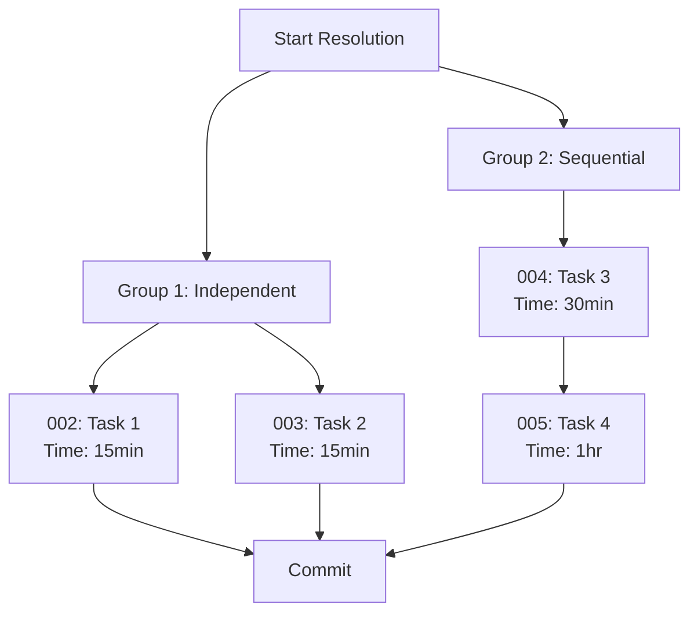
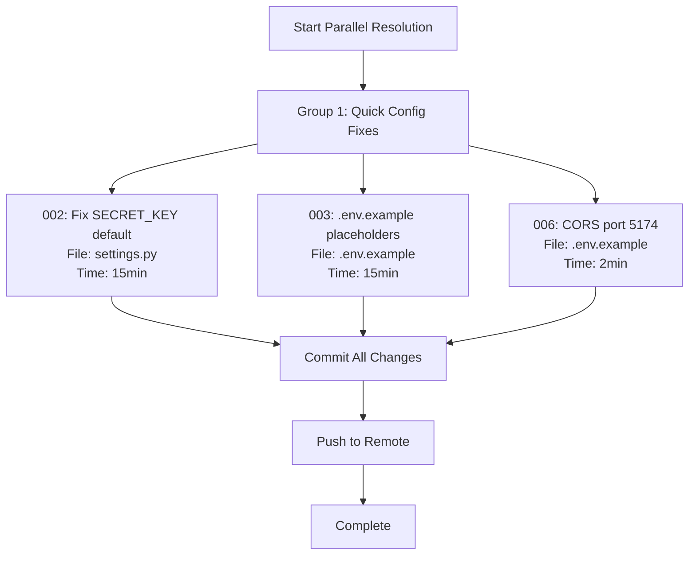
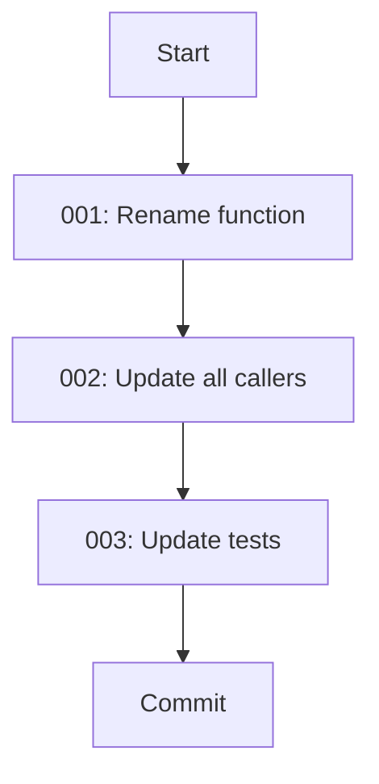

# Code Audit and TODO Resolution Patterns

**Created**: November 1, 2025
**Context**: Patterns codified from comprehensive codebase audit and parallel TODO resolution workflow

## Overview

This document captures proven patterns for conducting code audits, managing TODOs, and resolving technical debt systematically.

---

## Pattern 1: Comprehensive Codebase Audit Workflow

### When to Use
- User requests `/compounding-engineering:review audit code base`
- Periodic security audits (quarterly recommended)
- Before major releases
- After significant architectural changes

### Process

#### Step 1: Project Type Detection
```bash
# Check for project indicators
ls -la | grep -E "(Gemfile|package.json|requirements.txt|tsconfig.json)"
find . -maxdepth 3 -name "*.py" -o -name "*.ts" -o -name "*.tsx" -o -name "*.rb"
```

**Detected types**:
- Django + React (this project)
- Rails + TypeScript
- Python + FastAPI
- Pure frontend (React/Vue/Angular)

#### Step 2: Systematic Analysis

**Security Scan**:
```bash
# TODO/FIXME comments (technical debt markers)
grep -rn "TODO\|FIXME\|HACK\|XXX\|BUG" backend/apps --include="*.py" | wc -l

# Security patterns
grep -rn "API_KEY\|SECRET\|PASSWORD\|TOKEN" backend --include="*.py" | wc -l
grep -rn "eval\(|exec\(|__import__" backend --include="*.py"

# Console logging (frontend)
grep -rn "console\.log\|console\.error\|console\.warn" web/src --include="*.js" --include="*.jsx"

# Dangerous patterns (frontend)
grep -rn "dangerouslySetInnerHTML" web/src
grep -rn "localStorage\|sessionStorage" web/src
```

**Dependency Scan**:
```bash
# Backend
cd backend && pip list --outdated
safety check --json  # If available

# Frontend
cd web && npm audit --audit-level=moderate
```

**Performance Scan**:
```bash
# Database query optimization
grep -rn "select_related\|prefetch_related" backend/apps --include="*.py" | wc -l

# Count migrations (complexity indicator)
find backend/apps -name "migrations" -type d | xargs -I {} find {} -name "*.py" ! -name "__init__.py" | wc -l

# Test coverage indicator
find . -name "*.test.js" -o -name "*.test.jsx" -o -name "*test*.py" | wc -l
```

#### Step 3: Finding Categorization

**Severity Ratings**:
- 🔴 **P1 Critical**: Security vulnerabilities, data loss risks, production blockers
- 🟡 **P2 Important**: Performance issues, UX problems, significant technical debt
- 🔵 **P3 Nice-to-have**: Code quality improvements, optimizations, documentation

**Finding Template**:
```markdown
### Finding #N: [Brief Title]

**Severity**: 🔴/🟡/🔵 **PRIORITY (P1/P2/P3)**
**Category**: [Security/Performance/Code Quality/Configuration]
**Location**: `file/path:line_number`

**Problem**:
[Detailed explanation with code examples]

**Impact**:
- Security: [Risk description]
- Performance: [Impact on users]
- Maintainability: [Developer impact]

**Proposed Solution**:
```language
// Code example
```

**Effort**: Small (< 1hr) | Medium (1-3hrs) | Large (3+ hrs)
**Risk**: Low | Medium | High
```

#### Step 4: TODO File Generation

**For each finding**, create a TODO file:
```bash
# Determine next ID
NEXT_ID=$(ls backend/todos/ | grep -o '^[0-9]\+' | sort -n | tail -1 | awk '{print $1+1}')

# Format: NNN-pending-p[1-3]-brief-description.md
# Example: 003-pending-p1-env-example-secret-placeholders.md
```

**TODO File Structure** (from template):
```markdown
---
status: pending
priority: p1  # or p2, p3
issue_id: "NNN"
tags: [category1, category2, audit]
dependencies: []
---

# [Finding Title]

## Problem Statement
[Detailed problem description]

## Findings
- Discovered during: [Code review date]
- Location: [File paths]
- Impact: [Business/technical impact]

## Proposed Solutions

### Option 1: [Solution Name] (Recommended)
**Pros**: [Benefits]
**Cons**: [Drawbacks]
**Effort**: Small/Medium/Large
**Risk**: Low/Medium/High

**Implementation**:
```language
// Code example
```

### Option 2: [Alternative Solution]
...

## Recommended Action
[Which option and why]

## Technical Details
- Affected Files: [List]
- Related Components: [List]
- Database Changes: [Yes/No + description]

## Acceptance Criteria
- [ ] Criterion 1
- [ ] Criterion 2
- [ ] Tests pass

## Work Log
### YYYY-MM-DD - Discovery
**By:** Code Review System
**Actions:** [What was found]
**Learnings:** [Key insights]

## Notes
Source: Code review performed on [date]
```

#### Step 5: Dependency Flow Diagram

Create mermaid diagram showing resolution order:


**Color coding**:
- Red (#ff6b6b): P1 Critical
- Yellow (#ffd93d): P2 Important
- Green (#6bcf7f): P3 Nice-to-have

---

## Pattern 2: .env.example Secret Placeholder Security

### Problem
Weak placeholders like `your-secret-key-here` can be:
1. Accidentally used in production
2. Committed with real keys (developer mistake)
3. Pass basic validation checks
4. Lack clear generation instructions

### Solution: REQUIRED__* Pattern

**Pattern**:
```bash
# ❌ BEFORE (insecure):
SECRET_KEY=your-secret-key-here
PLANT_ID_API_KEY=your-plant-id-api-key-here
JWT_SECRET_KEY=your-jwt-secret-key-change-in-production

# ✅ AFTER (secure):
# Generate with: python -c 'from django.core.management.utils import get_random_secret_key; print(get_random_secret_key())'
SECRET_KEY=REQUIRED__GENERATE_WITH__python_-c_from_django_get_random_secret_key

# Get from: https://web.plant.id/
PLANT_ID_API_KEY=REQUIRED__GET_FROM__https://web.plant.id/

# Generate with: python -c 'import secrets; print(secrets.token_urlsafe(64))'
JWT_SECRET_KEY=REQUIRED__GENERATE_WITH__python_-c_import_secrets_token_urlsafe_64
```

### Rationale
- **REQUIRED prefix**: Makes it obvious value MUST be replaced
- **Fails validation**: Django SECRET_KEY validation will reject this pattern
- **Generation instructions**: Inline commands for easy copy-paste
- **Pattern detection**: Secret scanners won't flag these as false positives

### Apply To
- Django SECRET_KEY
- JWT authentication keys
- API keys (external services)
- Encryption keys (Fernet, AES, etc.)
- OAuth client secrets
- Database passwords

### Validation Pattern
Django settings should validate and reject REQUIRED__* pattern:
```python
# settings.py
INSECURE_PATTERNS = [
    'django-insecure',
    'change-me',
    'your-secret-key-here',
    'REQUIRED__',  # Add this
]

for pattern in INSECURE_PATTERNS:
    if pattern in SECRET_KEY:
        raise ImproperlyConfigured(f"SECRET_KEY contains placeholder: '{pattern}'")
```

---

## Pattern 3: CORS Configuration Documentation

### Problem
- .env.example had wrong port (3000, 5173)
- Actual dev server runs on port 5174
- New developers get immediate CORS errors
- No documentation of why certain ports are used

### Solution: Documented CORS Config

**Pattern**:
```bash
# CORS & Security Settings
# Note: React dev server runs on port 5174 (see CLAUDE.md)
# Add additional ports if using different configuration
CORS_ALLOWED_ORIGINS=http://localhost:5174,http://127.0.0.1:5174
CSRF_TRUSTED_ORIGINS=http://localhost:5174,http://127.0.0.1:5174
```

**Key elements**:
1. **Comment**: References source of truth (CLAUDE.md)
2. **Actual port**: Matches real dev server configuration
3. **Flexibility note**: Allows developers to add ports if needed
4. **Both localhost variants**: Covers 127.0.0.1 and localhost

### Verification Process
Before updating .env.example:
```bash
# 1. Check CLAUDE.md for official port
grep -A 3 "Port Reference" CLAUDE.md

# 2. Check vite.config.js for actual port
grep -E "port:|server:" web/vite.config.js

# 3. Check backend settings for CORS config
grep -A 5 "CORS_ALLOWED_ORIGINS" backend/plant_community_backend/settings.py
```

### When to Update
- Port changes in dev server configuration
- Adding new frontend applications
- Multi-environment setups (staging, production)
- Adding mobile app development servers

---

## Pattern 4: TODO Resolution Workflow (Parallel)

### When to Use
- User requests `/compounding-engineering:resolve_todo_parallel`
- After code audit creates multiple TODOs
- Sprint planning for technical debt reduction
- Before major releases

### Process

#### Step 1: Analyze All Pending TODOs
```bash
# Count pending todos
ls backend/todos/*-pending-*.md | wc -l

# List by priority
ls backend/todos/*-pending-p1-*.md  # Critical
ls backend/todos/*-pending-p2-*.md  # Important
ls backend/todos/*-pending-p3-*.md  # Nice-to-have
```

#### Step 2: Categorize by Effort

**Quick Wins** (< 1 hour):
- Configuration changes (.env.example)
- Simple code fixes (2-3 line changes)
- Documentation updates
- Priority: Resolve immediately

**Medium Tasks** (1-3 hours):
- Console log migrations
- Performance investigations
- Minor refactorings
- Priority: Batch resolution

**Large Tasks** (3+ hours):
- Architecture changes
- Framework migrations
- Comprehensive testing
- Priority: Dedicated sessions

#### Step 3: Check Dependencies

Read each TODO frontmatter:
```yaml
---
dependencies: [002, 003]  # Must resolve 002 and 003 first
---
```

Create dependency graph:
- Independent: Can run in parallel
- Sequential: Must wait for dependencies

#### Step 4: Resolution Strategy

**Parallel execution** (all independent):
```bash
# Attempt to launch pr-comment-resolver agents in parallel
# If API errors, fall back to direct resolution
```

**Sequential execution** (dependencies):
```bash
# Resolve in order: dependency → dependent
```

#### Step 5: Archive Resolved TODOs

**Naming convention**:
```bash
# Original: NNN-pending-p[1-3]-description.md
# Archived: YYYY-MM-DD-NNN-resolved-p[1-3]-description.md

mv backend/todos/003-pending-p1-env-example-secret-placeholders.md \
   backend/todos/archive/2025-11-01-003-resolved-p1-env-example-secret-placeholders.md
```

**Archive structure**:
```
backend/todos/
├── archive/
│   ├── 2025-11-01-002-resolved-p1-secret-key-already-implemented.md
│   ├── 2025-11-01-003-resolved-p1-env-example-secret-placeholders.md
│   └── 2025-11-01-006-resolved-p2-cors-port-5174.md
├── 004-pending-p2-migrate-remaining-console-logs.md
├── 005-pending-p3-audit-todo-comments.md
└── README.md
```

#### Step 6: Commit Strategy

**Single commit for batch resolution**:
```bash
git commit -m "fix(security): improve .env.example security placeholders and CORS config

Resolved 3 security and configuration TODOs from comprehensive codebase audit:

1. **TODO 003** (P1): Replace weak secret placeholders with REQUIRED__* pattern
   - [Details]

2. **TODO 006** (P2): Fix CORS configuration for React dev server port 5174
   - [Details]

3. **TODO 002** (P1): SECRET_KEY validation - Already implemented!
   - [Details]

**Files changed**:
- backend/.env.example: [What changed]
- backend/todos/: [What changed]

**Impact**: [User-facing improvements]

🤖 Generated with [Claude Code](https://claude.com/claude-code)

Co-Authored-By: Claude <noreply@anthropic.com>"
```

**Commit message structure**:
1. Type + scope (fix, feat, refactor, etc.)
2. Brief summary (50 chars)
3. Blank line
4. Detailed list of resolved TODOs
5. Files changed section
6. Impact section
7. Claude Code attribution

---

## Pattern 5: TODO File Lifecycle

### States

1. **Pending**: `backend/todos/NNN-pending-p[1-3]-description.md`
   - Status: Unresolved
   - Location: todos/ directory
   - Visible to resolution workflow

2. **In Progress**: Update status field in frontmatter
   ```yaml
   status: in_progress
   ```

3. **Resolved**: `backend/todos/archive/YYYY-MM-DD-NNN-resolved-p[1-3]-description.md`
   - Status: Resolved
   - Location: todos/archive/ directory
   - Includes resolution date in filename

### Naming Conventions

**Pending format**:
```
{issue_id}-pending-p{priority}-{brief-description}.md

Examples:
003-pending-p1-env-example-secret-placeholders.md
007-pending-p2-investigate-forum-n-plus-one.md
010-pending-p3-automated-dependency-scanning.md
```

**Resolved format**:
```
{date}-{issue_id}-resolved-p{priority}-{brief-description}.md

Examples:
2025-11-01-003-resolved-p1-env-example-secret-placeholders.md
2025-11-01-006-resolved-p2-cors-port-5174.md
```

### Work Log Pattern

Add entries to Work Log section as progress is made:
```markdown
## Work Log

### 2025-11-01 - Code Review Discovery
**By:** Claude Code Review System
**Actions:**
- Discovered during comprehensive codebase audit
- Analyzed .env.example secret management patterns
- Identified weak placeholder patterns across 5 critical keys

**Learnings:**
- Current validation would catch most insecure patterns
- But placeholders like "your-secret-key-here" could slip through
- Need explicit "REQUIRED" marker to prevent confusion

### 2025-11-01 - Resolution
**By:** [Developer name]
**Actions:**
- Replaced all 5 secret placeholders with REQUIRED__* pattern
- Updated .env.template (if exists)
- Verified Django SECRET_KEY validation rejects new pattern

**Outcome:**
- ✅ All secret placeholders now fail if used directly
- ✅ Generation instructions inline
- ✅ Committed as part of security fix batch
```

---

## Pattern 6: Mermaid Dependency Diagrams

### Purpose
Visualize TODO resolution order and parallelization opportunities.

### Basic Structure



### Color Scheme
- **Red** (#ff6b6b): P1 Critical - security, data loss, production blockers
- **Yellow** (#ffd93d): P2 Important - performance, UX, significant debt
- **Green** (#6bcf7f): P3 Nice-to-have - quality, optimizations, docs

### Node Labels
Include in each task node:
1. TODO ID (e.g., "002")
2. Brief description
3. Primary file affected
4. Estimated time

### Sequential Dependencies



---

## Success Metrics

### Audit Quality
- **Coverage**: All critical areas scanned (security, performance, quality)
- **Actionability**: All findings converted to TODOs with clear solutions
- **Prioritization**: Severity ratings match actual business impact
- **Completeness**: No major issues missed

### Resolution Efficiency
- **Quick wins**: All < 1hr tasks resolved in first session
- **Batch success**: Related TODOs resolved together
- **Archive rate**: Resolved TODOs properly archived
- **Commit quality**: Clear, comprehensive commit messages

### Pattern Adherence
- ✅ .env.example uses REQUIRED__* for all secrets
- ✅ CORS configs documented with port references
- ✅ TODO files follow standard format
- ✅ Mermaid diagrams show parallelization opportunities

---

## Tools and Commands

### Audit Commands
```bash
# Security scan
grep -rn "TODO\|FIXME\|HACK" backend/apps --include="*.py" | wc -l
grep -rn "eval\(|exec\(" backend --include="*.py"
npm audit --audit-level=moderate

# Performance scan
grep -rn "select_related\|prefetch_related" backend --include="*.py" | wc -l

# Dependency scan
cd backend && safety check --json
cd web && npm audit --json
```

### TODO Management
```bash
# Count pending
ls backend/todos/*-pending-*.md | wc -l

# List by priority
ls backend/todos/*-pending-p1-*.md

# Archive resolved
mv backend/todos/NNN-pending-*.md \
   backend/todos/archive/$(date +%Y-%m-%d)-NNN-resolved-*.md
```

---

## Related Documentation
- `backend/docs/development/SECURITY_PATTERNS_CODIFIED.md` - Security patterns
- `backend/docs/development/CODE_REVIEW_WORKFLOW.md` - Review process
- `backend/todos/README.md` - TODO file format reference
- `CLAUDE.md` - Project instructions and port reference

---

## Changelog

### 2025-11-01 - Initial Creation
- Codified patterns from comprehensive codebase audit
- Documented TODO resolution workflow
- Added .env.example security pattern
- Added CORS configuration pattern
- Created mermaid diagram guidelines
